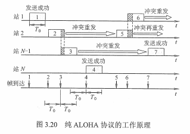
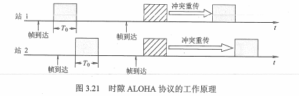

## 1 数据链路层功能

数据链路层在物理层提供的服务的基础上**向网络层提供服务**，其最基本的服务是将源自网络层来的数据可靠地传输到相邻节点的目标机网络层，其主要作用是**加强物理层传输原始比特流的功能**。

* 为网络层提供服务：无确认无连接服务、有确认无连接服务、有确认面向连接服务 -> 有连接就一定要有确认
* 链路管理：即连接的建立、维持、释放（亚于面向连接的服务）
* 组帧（帧定界、帧同步与透明传输）
* 流量控制：限制发送方
* 差错控制：帧错/位错

## 2 组帧
为了使接收方能正确地接收并检查所传输的帧，发送方依据一定的规则把网络层递交地**封装成帧**（组帧 -> 加头部、加首部），目前较为常用的是零比特填充法和违规编码法

### 2.1 字符计数法
在帧头部使用一个计数字段来标明帧内字符数，如果计数字段出错，收发双方失去同步造成错误。

### 2.2 字符填充的首尾定界符法
使用一些特定的自负来定界一帧的开始（DLE STX）与结束（DLE ETX）

### 2.3 零比特填充首尾标志法
使用一些特定的字符比特模式，即 01111110 来标志一帧的开始和结束，很容易由硬件来实现。

### 2.4 违规编码法
物理层进行比特编码，通常采用违规编码法，例如用高-高表示 0 ，低-低表示 1 。

## 3 差错控制
差错：由于噪声引起
- 内部：随机噪声 -> 提高噪声比
- 外部：冲击噪声 -> 使用编码技术
差错分类
- 位错：比特位出错，0 变 1，1 变 0 
- 帧错：丢失、重复、失序

### 3.1 检错编码

#### 3.1.1 奇偶校验码
n-1位数据和1位校验位组成，校验位用于调节发送信息中的1的个数是偶数还是奇数

#### 3.1.2 循环冗余码 CPC
任何一个由二进制数位串组成的代码都可以与一个只含有0和1两个系数的多项式建立一一对应关系

### 3.2 纠错编码
是在有效信息位中加入几个检验位形成海明码，并把海明码的每个二进制位分配到几个奇偶校验组中。当某一位出错后，就会引起有关的几个校验位的值发生变化，这不但可以发现错位，而且能指出错位的位置，为自动纠错提供依据。

## 4 流量控制与可靠传输机制

### 4.1 流量控制、可靠传输与滑动窗口机制
流量控制：接收方控制发送方的发送速率

#### 4.1.1 停止-等待流量控制
每发送完一个帧就停止发送，等待接收方的确认，在收到确认后再发送下一帧，如果没有收到确认，就一直等待

#### 4.1.2 滑动窗口流量控制
任意时刻，发送方维持一组连续的允许发送的帧的序号，称为发送窗口，接收方维持一组连续的允许接收的帧的序号，称为接收窗口。

##### 4.1.2.1 后退N帧协议（GBN）
发送方连续发送帧，当接收方检出失序的信息帧后，要求发送方重发最后一个正确接收的信息帧之后的所有未被确认的帧（累积确认）

##### 4.1.2.2 选择重传协议（SR）
每个发送缓冲区对应一个计时器，当计时器超时时，缓冲区的帧就会重传。

#### 4.1.3 可靠传输
使用确认和超时重传两种机制，

## 5 介质访问控制
### 5.1 介质概述
任务：为使用介质的每一个结点隔离来自同一信道上其他结点所传送的数据，以协调活动结点的传输，（互不干扰）

介质访问控制（MAC）层：用来决定广播信道中的信道分配。

常用的介质访问控制方法
- 信道划分介质访问控制 - 静态划分信道
- 随机访问介质控制 - 动态
- 轮询访问介质控制 - 动态

### 5.2 信道划分介质访问控制
多路复用技术：多个信号组合**一条物理设备上进行传输**，使多个计算机或终端共享信道资源，（拧成一捆发送）

分类：
- 频分多路复用（FDM）：将多路基带信号调制到不同频率载波上，再叠加成一个复合信号
- 时分多路复用（TDM）：将一条物理信按时间分成若干时间片，轮流地分配给多个信号使用
- 波分多路复用（WDM）：在一根光纤中传输不同波长的光信号
- 码分多路复用（CDM）
	- 采用不同的编码来区分各路原始信号
	- 码分多址（CDMA）：每比特时间被分成更短的时间槽
	
### 5.3 随机划分介质访问控制
所有用户能根据自己的意愿随机地发送信息，占用全部速率
#### 5.3.1 ALOHA 协议

##### 5.3.1.1 纯 ALOHA 协议
不监听信道，不按时间槽发送，随机重发，**想发就发**

##### 5.3.1.2 时隙 ALOHA 协议
控制想发就发随意性，把时间片分成若干个相同的时间片，所有用户在时间片开始时刻同步接入网络信道，若发生冲突，等待下一个时间片开始时刻再发送

#### 5.3.2 CSMA 协议
CS：载波侦听/监听，每一个站在发送数据之前都要检测一下总线是否有其他计算机在发送数据

MA：多点接入：多个计算机以多点接入的方式连接在一根总线上（总线型网络）

CD：碰撞检测（冲突检测），边发送边监听（半双工网络）

|          | 1-坚持CSMA   | 非坚持CSMA                       | p-坚持CSMA                                 |
| -------- | ------------ | -------------------------------- | ------------------------------------------ |
| 信道空闲 | 马上发       | 马上发                           | p概率马上发，1-p概率等待到下一个时隙再发送 |
| 信道忙   | 继续坚持监听 | 放弃监听，等压根儿随机时间再监听 | 持续监听，直到信道空闲再以p概率发送        |

#### 5.3.3 CSMA/CD 协议

适用于总线形网络或半双工网络环境，发送数据时先广播告知其他结点，让其他结点不要发送

#### 5.3.4 CSMA/CA 协议

适用于使用有线连接的局域网，发送前侦听，**边发送边侦听**，一旦出现碰撞马上停止发送

|              | CSMA/CD          | CSMA/CA                                          |
| ------------ | ---------------- | ------------------------------------------------ |
| 传输介质     | 以太网（有线）   | 无线局域网（无线）                               |
| 载波检测方式 | 电缆中电压的变化 | 能量检测（ED）、载波检测（CS）、能量载波检测混合 |
| 功能         | 检测冲突         | 避免冲突                                         |

### 5.4 轮询访问介质访问控制

令牌传递协议：通过一个集中控制的监控站，以循环方式轮询每个结点，再决定信道的分配。常用与负载较重、通信量较大的网络中

轮询协议：主结点轮流让从属结点发送数据

### 5.5 总结

信道划分介质访问控制协议：

- 基于**多路复用**
- 网络负载重：共享信道效率高，且公平
- 网络负载轻：共享信道效率低

随机访问 MAC 协议：（冲突）

- 用户根据意愿**随机**发送信息，发送信息时可独占信道带宽
- 网络负载重：产生冲突开销
- 网络负载轻：共享信道效率高，单个结点可利用的信道全部带宽

轮询访问 MAC 协议 / 轮流协议 / 轮转访问 MAC 协议：

- 不产出冲突，发送时占用全部带宽

## 6 局域网（LAN）

在一个较小地理范围内，将各种计算机等设备通过双绞线等介质连接，使用**广播信道**。

局域网：

* 有线局域网：常用介质：双绞线、同轴电缆、光纤
* 无线局域网：常用介质：电磁波

分类：

* 以太网
* 令牌环网
* FDDI 网
* ATM 网
* 无线局域网：采用 IEEE 802.11  标准

IEEE 802 标准将数据链路层分：

* LLC 子层：负责识别网络层协议
* （MAC 子层）介质访问控制子层：包括数据帧的各种操作，MAC 屏蔽了不同物理链路种类的差异性

### 6.1 局域网介质访问控制方法

* CSMA/CD：常用于总线型局域网、树型网络。
* 令牌总线：常用于总线型局域网、树型网络。
* 令牌网：环形局域网，如令牌环网

## 7 广域网

通常是覆盖范围很广的长距离网络，广域网由节点交换机以及连接这些交换机的链路组成。

### 7.1 PPP 协议

使用串行线路通信的**面向字节**的协议，该协议应用在直接连接两个结点的链路上。

注意：

* 提供差错检测，不提供纠错功能
* 仅支持点对点链路通信
* 只支持**全双工链路**
* 两端可以运行不同的网络层协议，仍然可使用同一个PPP通信
* 面向字节

组成：

* 一个将IP数据报封装到串行链路（同步串行/异步串行）
* 链路控制协议LCP
* 网络控制协议NCP

### 7.2 HDLC 协议

**面向比特**，采用0比特冲入发，帧类分为信息帧（D）、监督帧（S）、无编号帧（U）。

**全双工通信**，有较高的数据链路传输效率

HDLC 的站类型：主站（发送命令）、从站（接收主站）、复合站（能发送、能接收）

数据操作方式：

* 常响应方式
* 异步平衡方式
* 异步响应方式

## 8 数据链路层设备

### 8.1 网桥

特点：把两个或多个以太网通过网桥连接起来变成一个网段。

路径选择算法：

* 透明网桥（选择的不是最佳路由）：按照自学习算法填写转发表，按转发表转发
* 源路由网桥（选择的是最佳路由）：先发送发现帧，按返回结果转发

### 8.2 交换机

特点：实际就是一个多端口网桥

交换方式：

* 直通式：帧在接收后只检查目的地址，几乎能马上就能被传出去
* 存储转发：先将接收到的帧缓存到高速缓存器，检查数据正确性

网桥和交换机按 MAC 转发，都能隔离冲突域，不能隔离广播域

