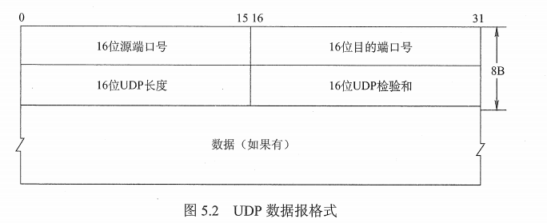
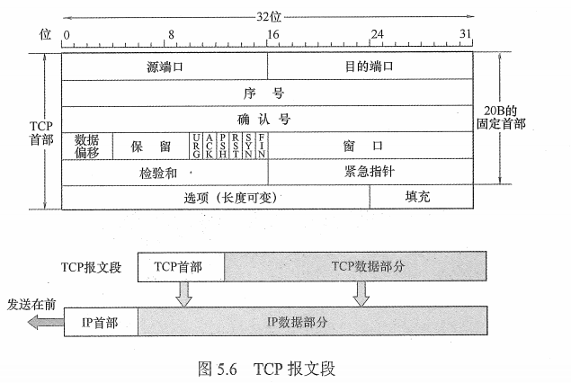
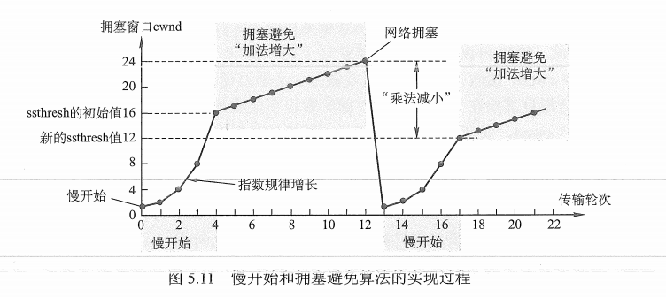
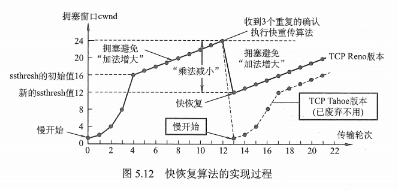

## 1 传输层提供的服务

### 1.1 功能

传输层向它上面的**应用层提供通信服务**，它属于面向部分的最高层，同时也是用户功能中的最底层。

为运行在不同**主机**上的进程之间提供了逻辑通信。

传输层的功能：

* 提供应用进程之间的逻辑通信（即端到端的通信）
* 复用和分用
  - 复用：应用层所有的应用进程都可以通过传输层再传输到网络层
  - 分用：传输层从网络层收到数据后交付指明的应用进程
* 对收到的报文进行差错检测
* 提供两种服务，面向连接 TCP 和 无连接的 UDP

### 1.2 寻址与端口

端口号只有本地意义，在因特网中不同计算机的相同端口是没有联系的。

端口号：

- 服务端的使用的端口号
  - 熟知端口号：0 - 1023
  - 登记端口号：1024 - 49151
- 客户端使用的端口号：仅在客户进程运行时才动态选择的端口号：49152 - 65535

套接字：唯一标识了网络中的一个主机和它上面的一个进程，socket = （主机IP地址，端口号）

### 1.3 无连接服务与面向连接服务 

* 面向连接：通信双方在通信之前，先建立连接，在通信过程中，会一直监控和管理
* 无连接：不需要先建立连接

TCP/IP协议族传输协议：

* 面向连接的传输协议控制协议（TCP）：全双工的可靠逻辑信道
* 无连接的用户数据报协议（UDP）：提供一条不可靠的逻辑信道

TCP/IP协议：

* TCP提供面向连接的可靠传输协议，增加了许多开销，如确认、流量控制、计时器及连接管理
* TCP适用于可靠的场合，如 FTP、HTTP、TELNET

UDP协议：

* 在 IP 上提供两个附加服务：多路复用、对数据的错误检查
* 远程主机收到UDP报文后，不需要给出任何确认、
* 适用于 ：TFTP、DNS、SNMP、RTP

### 1.4 注意

IP数据报和UDP数据报：

- IP数据报在网络层要经过**路由存储转发**
- UDP数据报的信息对路由不可见，在传输层的端到端的**逻辑信道中传输**，封装成IP数据报在网络层中传输。

TCP 和 网络层虚电报：

* TCP报文段在传输层抽象的逻辑信道中传输，对路由不可见。
* 虚电路所经过的交换结点都必须保存虚电路状态信息，在网络中若采用虚电路方式，则无法提供无连接服务，而传输层采用 TCP 不影响网络层提供无连接服务。


## 2 UDP 协议

### 2.1 UDP 数据报

UDP 优点：

* 无须建立连接
* 无连接状态
* 分组首部开销小

特点：

* 常用于一次性传输较少数据的网络应用，如 DNS、SNMP
* 尽最大努力交付，**不保证可靠交付**。
* **面向报文**

UDP 的首部格式：

* 源端口
* 目的端口
* 长度
* 检验和



### 2.2 UDP 校验

只校验和检查首部和数据部分。

## 3 TCP 协议

### 1.1 特点

* 面向连接（虚连接）的传输层协议
* 点对点
* **可靠交付服务**、不丢失、不重复
* 全双工通信
* **面向字节流**

### 1.2 TCP 报文段



### 1.3 TCP 连接管理

TCP 连接管理就是使运输连接的建立和释放都能正常进行。

连接阶段：连接建立、数据传送、连接释放

#### 1.3.1 三次握手

客户机 TCP 首先向服务器 TCP 发送一个连接请求报文段（SYN = 1, seq = x）

服务器 TCP 收到连接请求报文段，如同意，发送确认（SYN = 1，ACK = 1，seq = y，ack = x + 1）

客户机收到确认报文段后，向服务器给出确认，（ACK = 1，ack = y + 1，seq = x + 1）

```java
//三次握手
A：有件事不知当讲不当讲
                          B：讲
A：MMP

//四次挥手
A：我讲完了
                          B：好，我来讲
                          B：MMP，我讲完了
A：好
```


#### 1.3.2 四次挥手

客户机向其 TCP 发送一个**连接释放报文段**，并停止发送数据，主动关闭 TCP 连接（终止位 FIN = 1，seq = u）

服务器收到连接释放报文段后即发出确认，客户到服务器这个方向的连接解决释放了-半关闭（ACK = 1，seq = v，ack = u + 1）

服务器通知客户端 **TCP释放连接**，主动关闭TCP连接（FIN = 1，ACK = 1，seq = w，ack = v + 1）

客户机收到连接释放报文后，发出确认（ACK = 1，seq = u + 1，ack = w + 1）

### 1.4 SYN 洪泛攻击

当服务器返回 ACK ，攻击者不确认，一直耗着，占用 CPU 资源。

### 1.5 可靠传输（实现机制）

* 序号
* 确认
* 重传（超时、冗余 ACK）

### 1.6 TCP 流量控制

匹配发送方的发送速率与接收方的读取速率

#### 1.6.1 流量控制机制

基于滑动窗口协议。

实现：

* **限制发送方向网络注入报文的速率**，接收方根据自己接收缓存大小，动态调整发送方的发送窗口（接收窗口 rwnd）
* 发送方根据其到当前网络拥塞程序的估计而确定的窗口值，这称为拥塞窗口 cwmd，其大小与网络的带宽和时延有关

### 1.7 TCP 拥塞控制

防止过多的数据注入到网络中。

#### 1.7.1 慢开始 拥塞避免



### 1.7.2 快重传 快恢复

