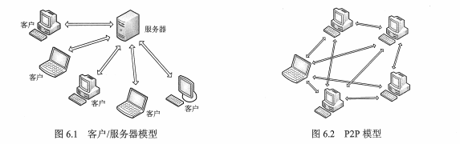
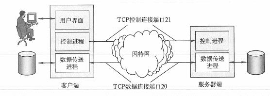

## 1 网络应用模型

### 1.1 客户/服务器模型

总是打开一个主机称为服务器，服务与其他客户机的请求。

### 1.2 P2P 模型

任意一对计算机-称为对等方，直接相互通信。(每一台计算机既是客户机，又是服务器)



## 2 域名系统（DNS）

具有特定含义的主机名（www.baidu.com -> 192.139.1.1）转换成 IP 地址。

### 2.1 概述

### 2.2 层次域名空间

www.baidu.com -> 三级域名.二级域名.顶级域名

顶级域名(国家顶级域名（cn、us、jp）、通用顶级域名（com、org、net）、基础结构域名（arpa-> 只有一个，叫方向域名解析（方向域名））)

### 2.3 域名服务器

域名系统被设计成联机分布式的数据库系统，并采用客户/服务器模型。4 种类型的域名服务器。

* 根域名服务器：管辖顶级域
* 顶级域名服务器：管理二级域名
* 授权域名服务器（权限域名服务器）：管辖的主机名转换为该主机的 IP 地址
* 本地域名服务器：对域名系统非常重要，ISP、一所大学、甚至一个系都可以有一个本地域名服务器。


### 2.4 域名解析过程

正向解析：域名 -> IP
反向解析：IP -> 域名

当客户端需要域名解析时，通过本机的DNS客户端构造一个DNS请求报文，以 UDP 数据报文 发往本地域名服务器。

域名解析有两种方式:

* 递归查询（负载过大，不常用）
* 递归与迭代相结合查询


为了提高 DNS 的查询效率，通常采用**高速缓存**，DNS 会将 DNS 信息缓存到高速缓存中，并且美国一段时间就会丢弃高速缓存。

## 3 文件传输协议（FTP）

###  3.1 FTP 的工作原理

使用 TCP 可靠的除数服务，一个 FTP 服务器可以为多个客户进程提高服务，分为两个部分：主进程（接收请求），若干从属进程（处理单个请求）。

FTP 服务器在整个会话期间**保留状态信息**。

### 3.2 控制连接与数据连接

FTP 工作时使用两个并行 TCP 连接：控制连接（port：21）、数据连接（post：20）




## 4 电子邮件

### 4.1 电子邮件系统的组成结构

电子邮件是一种一步异步通信方式。

一个电子邮件系统由三个组成构件：用户代理（User Agent）、邮件服务器、电子邮件使用协议，如 SMTP、POP3（或 IMAP） 等。


* 用户代理（UA）：用户与电子邮件系统的接口，如 Outlook、Foxmain 等。
* 邮件服务器：组成电子邮件系统的核心。
* 邮件发送协议和读取协议：SMTP（PUSH 推方式）、POP3（PULL 拉）。


### 4.2 电子邮件格式与 MIME

电子邮件格式：

```java
From：hoo@hus.edu.cn
To:3988099@qq.com
Subject：Say hello
balabala....
    
首部（From、To、Subject） + 主体    
```

### 4.3 SMTP 和 POP3

#### 4.3.1 SMTP

简单邮件传输协议：提供可靠有效的电子邮件传输的协议，用的是 TCP 连接，端口号 25。

三个部分：连接建立、邮件传送、连接释放

#### 4.3.2 POP3

邮局协议：简单功能有限的邮件读取协议，传输层使用 TCP ，端口 110。

## 5 万维网（WWW）

### 5.1 WWW 的概念与组成结构

三个标准组成：

* 统一资源定位符（URL）：负责标识万维网上的各种文档。
* 超文本传输协议（HTTP 端口 80）：应用层协议，使用 TCP 谅解进行可可靠传输。
* 超文本标记语言（HTML）：文档结构标记语言，使用约定的标记对页面上的各种信息进行描述。


### 5.2 浏览器访问过程

```java
1.浏览器分析链接指向页面的 URL (http://www.baidu.com/index.html)
2.浏览器解析 DNS 请求解析 IP 地址
3.域名系统 DNS 解析 IP 地址
4.建立 TCP 连接（端口 80）
5.发出 HTTP 请求 GET /index.html
6.服务器 HTTP 响应返回
7.释放 TCP 连接
8.解析 html 文件，显示                    
```

### 5.3 HTTP 特点

* http 是无状态的
* 通常使用 Cookie 加数据库跟踪用户活动
* 采用 TCP 作为运输层协议，保证数据可靠传输，但，HTTP 是无连接的
* HTTP 即可以使用非持久连接，也可以使用持久连接（HTTP/1.1 支持）


### 5.4 HTTP 报文结构

* 请求报文：客户端 -> 服务器
* 响应报文：服务器 -> 客户端


### 5.5 常用应用层协议

