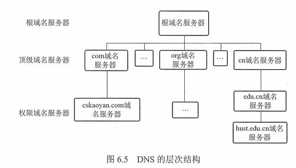

## 1 网络应用模型

### 1.1 客户/服务器模型

### 1.2 P2P 模型

## 2 域名系统（DNS）

### 2.1 概述

### 2.2 层次域名空间

www.baidu.com -> 三级域名.二级域名.顶级域名

顶级域名(国家顶级域名（cn、us、jp）、通用顶级域名（com、org、net）、基础结构域名（arpa-> 只有一个，叫方向域名解析（方向域名））)

### 2.3 域名服务器

域名系统被设计成联机分布式的数据库系统，并采用客户/服务器模型。4 种类型的域名服务器。

* 根域名服务器：管辖顶级域
* 顶级域名服务器：管理二级域名
* 授权域名服务器（权限域名服务器）：管辖的主机名转换为该主机的 IP 地址
* 本地域名服务器：对域名系统非常重要，ISP、一所大学、甚至一个系都可以有一个本地域名服务器。

### 2.4 域名解析过程

正向解析：域名 -> IP
反向解析：IP -> 域名

当客户端需要域名解析时，通过本机的DNS客户端构造一个DNS请求报文，以 UDP 数据报文 发往本地域名服务器。

域名解析有两种方式:

* 递归查询（负载过大，不常用）
* 递归与迭代相结合查询

为了提高 DNS 的查询效率，通常采用**高速缓存**，DNS 会将 DNS 信息缓存到高速缓存中，并且美国一段时间就会丢弃高速缓存。

## 3 文件传输协议（FTP）

## 4 电子邮件

## 5 万维网（WWW）