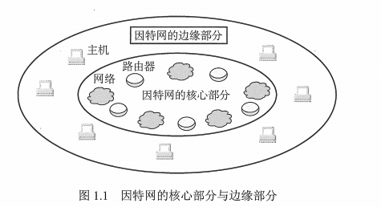
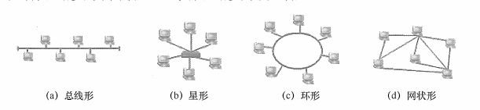

## 1 概念
计算机网络是一些互联、自治的计算机系统的集合。

### 1.1 广义观点
实现远程信息处理的系统或能进一步达到资源共享的系统，物理结构上具有计算机网络的雏形。

### 1.2 资源共享观点
能够相互共享资源的方式互联起来的资源计算机系统的集合。

### 1.3 用户透明观点
存在一个能为用户自动管理资源的网络操作系统，它能够调用用户所需要的资源，而整个网络就像个大的计算机系统对用户是透明的。

## 2 计算机网络的组成
### 2.1 从组成部分
* 硬件：主机（端系统）、通信链路（双绞线、光纤）、交换设备（路由器、交换机）、通信处理机（网卡）
* 软件：资源共享的软件、用户使用的软件工具（聊天工具、FTP）
* 协议：网络传输数据的规范

### 2.2 从工作方式部分
* 边缘部分：实现资源共享的主机
* 核心部分：大量网络和路由器

### 2.3 从功能组成
* 通信子网：传输介质、通信设备、网络协议
* 资源子网：实现资源共享功能的设备及其软件的集合，向网络用户提供共享其他计算机上的硬件资源、软件资源、数据资源

## 2 计算机网络的功能
* 数据通信
* 资源共享
* 分布式处理
* 提高可靠性
* 负载均衡

## 3 计算机网络分类
### 3.1 按分布范围分类
* 广域网（WAN）：提供长距离通信，距离几十千米到几千千米，也称远程网，是因特网核心部分，采用交换技术。
* 城域网（MAN）：几个街区或一个城市，距离5-50km。大都采用以太网技术。
* 局域网（LAN）：一般用微机或工作站通过高速线路相连，几十米到几千米，采用广播技术。
* 个人区域网（PAN）：个人电子设备（手机、笔记本），范围约十米左右，又称无限个人局域网（WPAN）。

### 3.2 按传输技术分类
* 广播式网络：所有联网计算机共享一个公共通信信道
* 点对点网络：每条物理线路连接一对计算机

### 3.3 按拓扑结构分类
* 总线形
* 星形
* 环形
* 网状形

### 3.4 按使用者分类
* 公用网（公众网）：电信公司出资建造的大型网络。
* 专用网：专门网络，铁路、电力、军队

### 3.5 按交换技术分类
* 电路交换网络：电路交换要求必须首先在通信双方之间建立连接通道。包括建立、连接、传输数据、断开连接，例如传统电话网络。
* 报文交换网络：采用"存储-转发"方式进行传送，无需事先建立线路，事后更无需拆除。它的优点是：线路利用率高、故障的影响小、可以实现多目的报文；缺点是：延迟时间长且不定、对中间节点的要求高、通信不可靠、失序等，不适合计算机网络。
* 分组交换网络：是一种数位通信网络。它将资料组合成适当大小的区块，称为封包，再通过网络来传输。这个传送封包的网络是共享的，每个单位都可以独立把封包再传送出去，而且配置自己需要的资源。

## 3.6 按传输介质分类
* 有线：双绞线、同轴电缆
* 无线：无线、蓝牙

## 4 计算机网络的标准化工作及相关组织
因特网所有标准都以 RFC 的形式在因特网上发布。
* 因特网草案
* 建议标准
* 草案标准
* 因特网标准

## 5 计算机网络的性能指标
### 5.1 带宽
网络的通信线路所能传送数据的能力，指数字信道所能传送的"最高数据率",单位是"比特每秒"或 b/s (bit/s)

### 5.2 时延
数据（一个报文或分组）从网络（或链路）的一端传送到另一端所需的时间。

组成：
* 传输时延(发送时延)
	- 发送数据时,数据块从结点进入传输媒体所需要的时间也就是从发送数据帧的第一个比特算起,到该帧的最后一个比特发送完毕所需的时间
* 传播时延
	- 电磁波在信道中需要传播一定的距离而花费的时间
* 处理时延
	- 交换结点为存储转发而进行一些必要的处理所花费的时间
* 排队时延
	- 结点缓存队列中分组排队所经历的时延，输入队列中排队等待处理，输出队列中排队等待处理

总时延= 发送时延+传播时延+处理时延+处理时延

### 5.3 时延带宽积
时延带宽积 = 带宽 × 传播时延

### 5.4 往返时延（Round-Trip，RTT）
从发送数据开始到接收到对方的确认的时间值
### 5.5 吞吐量
表示在单位时间内通过某个网络(或信道,接口)的数据量，吞吐量受网络的带宽或网络的额定速率的限制
### 5.6 速率
连接计算机网络的主机在数字信道上传送数据的速率,单位是比特bit)
### 5.7 信道利用率
某信道有百分之几的时间是被利用的(有数据通过,完全空闲的信道的利用率是零,并非越高越好)

