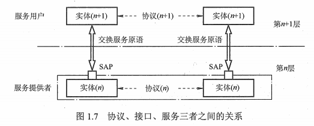
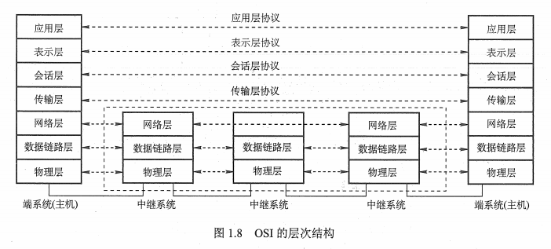
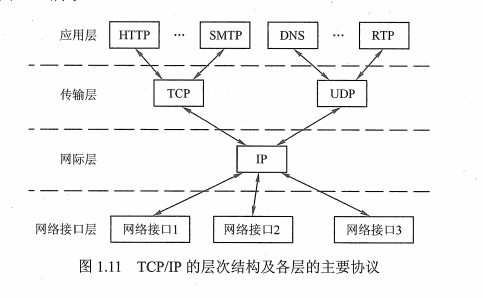
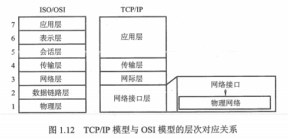
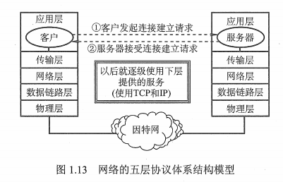

## 1 计算机网络分层结构
把计算机网络的各层及其协议的集合称为网络的体系结构。换言之，计算机网络的体系结构就是这个计算机网络及其所应完成的功能的功能的精确定义。

在计算机网络的分层结构中，第 n 层中的活动元素通常称为  n  层实体。具体地，实体指任何可发送或接收信息的硬件或软件进程，通常是一个特定的软件模块。不同机器上同一层称为对等层，同一层的实体叫做对等实体。n 层实体实现的服务为 n + 1 层所利用。在这种情况下， n 层被称为服务提供者，n + 1 层是服务用户。

在计算机网络体系结构的各个层次中，每一个报文都分为两个部分，数据部分（SDU）、控制信息部分（PCI），们共同组成 PDU。

* 服务数据单元（SDU）：为完成用户所要求的功能而应传送的数据。第 n 层的服务数据单元记为 n-SDU。
* 协议控制信息（PCI）：控制协议操作的信息。第 n 层的协议控制信息记为 n-PCI 。
* 协议数据单元（PDU）：对等层次之间传送的数据单位称为该层的 PDU 。第 n 层的协议数据单位记为  n-PDU。在实际的网络中，每层的协议数据单元都有一个通俗的名称，如物理层的 PDU 叫比特，链路层的 PDU 叫帧，网络层的 PDU 叫分组，传输层的 PDU 叫报文。

## 2 计算机网络协议、接口、服务的概念

### 2.1 协议
协议，就是规则的集合。在网络中要做到有条不紊地交换数据，就必须遵循一些事先约定好的规则，例如  TCP / IP 协议栈。

### 2.2 接口
接口是同一结点内相邻两层间交换信息的连接点，是一个系统内部的规定，每一层只能为紧邻的层次之间定义接口，不能跨层次定义接口。

### 2.3 服务
服务是指下层为紧相邻的上层提供的功能调用，也就是垂直的。对等实体在协议的控制下，使得本层能为上一层提供服务，但要实现本层协议还需要使用下一层所提供的服务。

上层使用下层所提供的服务必须通过与下层交换一些命令，这些命令在OSI 中称为 服务原语。OSI 将原语划分为四类：
* 请求：由服务用户发往服务提供者，请求完成某项工作。
* 指示：由服务提供者发往服务用户，指示用户做某件事。
* 响应：由服务用户发往服务提供者，最为对指示的响应。
* 证实：由服务提供者发往服务用户，作为对请求的证实。

计算机网络提供的服务可以按以下三种方式分类：
* 面向连接服务和无连接服务
* 可靠服务和不可靠服务
* 有应答服务和无应答服务

## 3 ISO / OSI 参考模型和 TCP / IP 模型
### 3.1 OSI参考模型
国际标准化组织（ISO）提出的网络体系结构模型，称为开放系统互联参考模型（OSI / RM），通常简称为 OSI 参考模型。OSI有七层，自下而上
依次为物理层、数据链路层、网络层、运输层、会话层、表示层、应用层。低三层统称为通信子网，它是为了联网而附加上去的通信设备，完成数据的
传输功能；高三层统称为资源子网，它相当于计算机系统，完成数据的处理等功能。运输层承上启下，OSI 层次结构图如下：

#### 3.1.1 物理层
传输单位是比特，任务是透明的传输比特流，功能是在物理媒体上为数据端设备透明的传输原始比特流。

物理层主要定义数据终端设备（DTE）和数据通信设备（DCE）的物理和逻辑连接方法，所以物理层协议也称为物理层接口标准。

物理层接口标准有很多，如 EIA-232C 、EIA / TIA RS --449 、 CCITT 的 X.21 等。

#### 3.1.2 数据链路层
数据链路层的传输单位是帧，任务是将网络层传下来的 IP 数据报组装成帧。数据链路层的功能可以概括为：成帧、差错控制、流量控制和传输管理等。

数据链路层协议有： SDLC  、HDLC 、PPP 、 STP 和帧中继等。

#### 3.1.3 网络层

网络层的传输单位是数据报，它关心的是通信子网的运行控制，主要任务是把网络层的协议数据单元（分组）从源端传到目的端，为分组交换网上的不同主机提供通信服务。关键问题是对分组进行路由选择，并实现流量控制、拥塞控制、差错控制和网际互联等功能。

网络层的协议有：IP、IPX、 ICMP、 IGMP 、ARP 、RARP 和 OSPF 等。

#### 3.1.4 传输层
传输层也叫运输层，传输单位是报文段（TCP）或用户数据报（UDP），传输层的任务是负责主机中两个进程之间的通信。功能是为端到端连接提供可靠的传输服务；为端到端连接提供流量控制、差错控制、服务质量、数据传输等服务。

数据链路层提供的是点到点（IP地址）的服务，传输层提供的是端到端（端口）的通信。

由于一个主机可同时运行多个进程，因此传输层具有复用和分用的功能。复用就是多个应用层进程可同时使用下面运输层的服务。 分用则是运输层把收到的信息分别交付给上面应用层中相应的进程。

传输层的协议有：TCP 、UDP。

#### 3.1.5 会话层
允许不同主机上各进程之间的会话。会话层利用传输层提供的端到端服务，向表示层提供它的增值服务。这种服务主要是向表示层实体或用户进程提供建立连接并在连接上有序地传输数据，这就是会话，也称为建立同步（SYN）。
会话层负责管理主机间会话进程，包括建立、管理以及终止进程间的会话。会话层使用校验点可使通信会话在通信失效时从校验点继续恢复通信，实现数据同步。

#### 3.1.6 表示层
主要用于处理在两个通信系统中交换信息的表示方式。不同机器采用的编码和表示方式不同，使用的数据结构也不同。为了使不同表示方法的数据和信息能互相交换，表示层采用抽象的标准方法定义数据结构，并采用标准的编码形式。数据压缩、加密和解密也是表示层可以提供的数据表示交换功能。

#### 3.1.7 应用层
最高层，是用户与网络的界面。应用层为特定类型的网络应用提供访问 OSI 环境的手段。因为用户的实际应用多种多样，要求应用层采用不同的应用协议来解决不同类型的应用要求。

传输层的协议有：FTP、SMTP、HTTP 。
### 3.2 TCP/IP 模型

#### 3.2.1 网络接口层
功能类似于 OSI 的物理层和数据链路层。它表示与物理网络的接口但实际上 TCP / IP 本身并没有真正描述这一部分，只是指出主机必须使用某种协议与网络连接，以便能在其传递 IP 分组。具体的物理网络可以是各种类型的局域网，如以太网、令牌环网、令牌总线网等，也可以是诸如电话网、SDH 、X.25 、帧中继和 ATM 等公共数据网络。网络接口层的责任是从主机或结点接收 IP 分组，并把它们发送到指定的物理网络上。

#### 3.2.2 网际层
网际层（主机--主机）是TCP / IP 体系结构的关键部分。它和 OSI 网络层的功能非常相似。网际层将分组发往任何网络，并为之独立地选择合适的路由，但并不保证各个分组有序的到达，各个分组的有序交付由高层负责。

网际层定义了标准的分组格式和协议，即 IP协议。当前采用的 IP 协议是第 4版，即 IPV4 ，它的下一个版本是 IPV6。

#### 3.2.3 传输层
传输层（应用--应用，或 进程---进程）的功能同样与 OSI 中的传输是类似，是使发送端和目的端主机上的对等实体可以进行会话 。

传输层主要以下两种协议：

* 传输控制协议（TCP）。面向连接的，数据传输单位是报文段，能够提供可靠的交付。
* 用户数据报协议（UDP）。无连接的，数据传输的单位是用户数据报，不保证提供可靠的交付，只能提供“尽最大努力交付”。
#### 3.2.4 应用层
应用层（用户---用户）包含所有的高层协议。如虚拟终端协议（Telnet）、文件传输协议（FTP）、域名解析服务（DNS）、电子邮件协议（SMTP）

## 4 TCP/IP 和 OSI

## 5 五层模型

