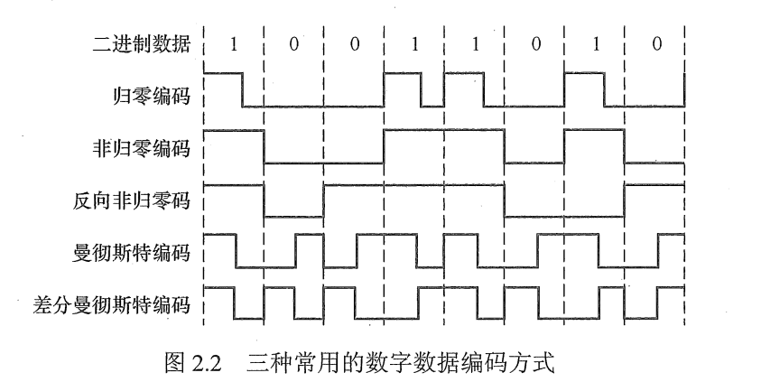

## 1 通信基础

### 1.1 数据、信号与码元

* 数据：传送信息的实体（分为：模拟的、数字的）
  	- 模拟：连续变化
  	- 数字：有限的几个离散数值的数据
* 信号：数据的电气或电磁表现（分为：模拟的、数字的）
* 码元：用一个固定时长的信号波形（数字脉冲）表示以为 k 进制数字，代表不同离散数值的基本波形。

### 1.2 信源、信道与信宿

数据通信：数字计算机或其他数字终端之间的通信。数据通信系统主要划分以下三部分：

* 信源：产生和发送数据的源头。

* 信宿：接收数据的终点

* 信道：信号的传输媒介

信道按传输信号形式不同分为：

* 模拟信号
* 数字信道

信道按传输介质分为：

* 无线信道
* 有线信道

信道上传送的信号分为：

* 基带信号：数字信号 1 和 0 两种电压表示 -> 送到数字信道上传递（基带传输）
* 宽带信号：基带信号进行调制后变为频分复用模拟信号 -> 模拟信道上传输（宽带传输）

从通信双方信息的交互方式看：

* 单工通信：只有一个方向，需要一条信道。
* 半双工通信：通信双方都可以发送、接受信息，但是不能同时发送、接受，需要两条信道。
* 全双工通信：通信双方都可以发送、接受信息，可以同时发送、接受，需要两条信道。

### 1.3 速率、波特与宽带

* 速率：也叫数据率，指数据的传输速率，表示单位时间内传输的数据量，可以用码元传输速率，信息传输速率表示。
  - 码元传输速率：1s 传输多少个码元，也可称为脉冲个数或者是信号变化的次数
  - 信息传输速率：也叫比特率，信息速率。1s 能传输多少个比特
* 带宽：通信线路所能传输数据能力，单位 b/s。

## 2 奈奎斯特定律与香农定律

### 2.1  奈奎斯特定律

表示一个有线宽带的无噪声信道的最大数据传输率。

Cmax=2B*log2V（bps）

B：带宽{  模拟带宽hz  数字带宽bps} 信号在最高和最低信号频率中通过，最高信号频率和最低信号频率的差值就叫做带宽。

### 2.2 香农定律

容量：信道中最高的比特率

信道的极限传输速率（信道的最大容量）Cmax

Cmax=Blog2(1+S/N)

S/N:信噪比  信号功率S  噪声功率N

## 3 编码与调制

调制：数据 -> 模拟信号 。

编码：数据 -> 数字信号。

### 3.1  数字数据编码为数字信号

#### 非归零码

用高，低电压分别来代表 1，0 二进制（相反也可以）。

#### 曼切斯特编码

将一个码元分为相等的两个部分，由高电平到低电平表示 1，由低电平到高电平表示 0（前高后低为 1，相反为 0）

#### 差分曼切斯特编码

若位开始（每一位码元开始的地方）有跳变为 0，无跳变为 1.

### 3.2 数字数据编制为模拟信号

