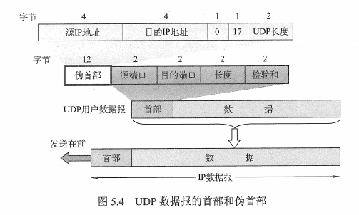

## 1 UDP 数据报

优点：

* 无须建立连接，速度快。
* 无连接状态，不需要维护连接状态。
* 分组首部开销小，TCP（20B），UDP（8B）。
* 应用层能够更好地控制要发送的数据和发送时间，（UDP 没有拥塞控制）

## 2 UDP 的首部格式

两部分组成：

* UDP 首部：
  - 源端口：源端口号。在需要对方回信时选用。不需要时可用全0。
  - 目的端口：目的端口号。这在终点交付报文时必须要使用到。
  - 长度：UDP用户数据报的长度，其最小值是8（仅首部）。
  - 校验和：检测UDP用户数据报在传输中是否有错。有错就丢弃。
* 用户数据

## 3 UDP 检验和

对发送方的 UDP 报文段的所有 16 比特字的和进行反码运算，当求和遇见溢出的时候，进行回卷（回卷的补充在下面），得到的结果放在 UDP 报文段中的检验和字段。

所谓 “回卷” 就是当进行 16 比特的加法运算的时候，如果进位到 17位，则将第 17 位和后 16 位进行加法和运算。