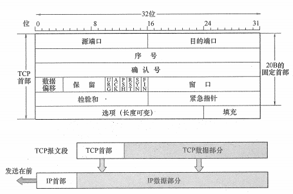
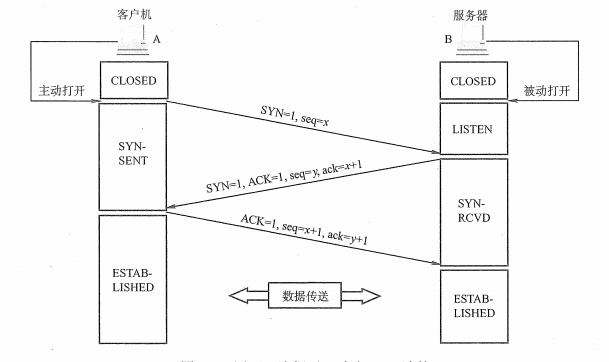
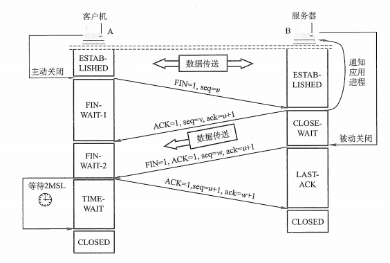

## 1 TCP 协议的特点
* 面向连接传输层协议
* 每条 TCP 连接点对点（一对一）
* 可靠的交付服务，保证传送的数据无差错、不丢失、不重复且有序
* 全双工通信
* 面向字节流

## 2 TCP 报文段
传送的数据单元称为报文段（TCP 首部、TCP数据）。



1. 源端口：发送方端口，`16位`

2. 目的端口：接收方端口，`16位`

3. 序号：本报文段所发送的数据-的第一个字节的序号

4. 确认号：期望收到下一个报文段数据的第一个字节的序号

5. 数据偏移：TCP首部长度，最大长度为(24 - 1) * 4B = `60B`，固定首部`20B` + 可变头部`40B`。由于首部长度不固定，所以数据起始位置不固定
6. 六个控制位
   - 紧急位`URG`：发送方紧急处理位。`URG=1`表示此段报文有紧急数据，要立即发送出去，不用在缓存队列中排队，配合紧急指针**插队优先处理**
   - 确认位`ACK`：`ACK=1`，确认号有效
   - 推送位`PSH`：接收方紧急处理位。`PSH=1`时，接收方尽快向应用进程交付此段报文，不必等缓存队列填满
   - 复位`RST`：`RST=1`时，表示TCP与主机的连接**出现严重差错**，必须释放连接再重新建立
   - 同步位`SYN`：`SYN=1`，表明一个连接 **请求/连接**接收报文
   - 终止位`FIN`：`FIN=1`，表明发送方数据已发完，要求释放连接

7. 窗口：接收方接收窗口的大小，即现在允许发送方发送的数据量，根据接收方的窗口大小，设置发送方的发送缓存
8. 检验和：检验首部 + 数据，检验时要加上`12B`伪首部「伪IP数据报首部」；第四个字段为协议字段，TCP为`6`，UDP为`17`
9. 紧急指针：`URG=1`时才有意义，指出本报文段中紧急数据的位置
10. 选项：最大报文段长度MSS、窗口扩大、时间戳、选择确认
11. 填充：填充0保证4字节对齐

## 3 TCP 连接管理

### 3.1 建立连接(三次握手)



```java
同步位SYN = 1，序号seq = x
同步位SYN = 1，确认位ACK = 1，序号seq = y，确认号ack = x + 1
确认位ACK = 1，序号seq = x + 1，确认号ack = y + 1 
```

### 3.2 释放连接(四次挥手)



```java
FIN = 1,seq = u
ACK = 1,seq = v,ack = u + 1 (客户机 -> 服务器：关闭)
FIN = 1,ACK = 1,seq = w,ack = u + 1    
ACK = 1,seq = u + 1,ack = w + 1     
```

## 4 可靠传输

* 序号
* 确认
* 重传（超时、冗余ACK）

## 5 流量控制

## 6 拥塞控制