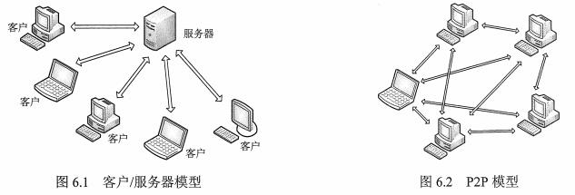

## 1 客户/服务器模型
客户/服务器（Client/Server,C/S）模型，过程：
* 服务器处于接收请求的状态
* 客户机发出服务请求，并等待接收结果
* 服务器收到请求后，分析请求，处理请求，返回结果。

常见：Web、文件传输协议（FTP）、远程登录、电子邮件

## 2 P2P模型
各计算机没有固定的客户机和服务器划分，任意一对计算机--称为对等方，直接相互通信。
优点：
* 减轻服务器压力
* 客户机可以直接共享文档
* 可扩展性好
* 网络健壮性强

缺点：
给其他结点提供服务，会占用较多内存，影响整机速度。

