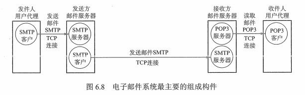
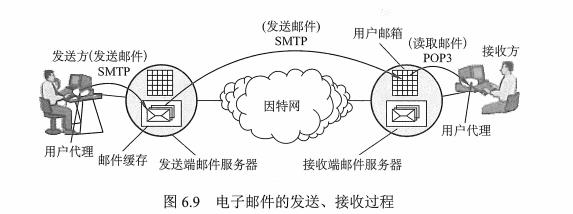

## 1 电子邮件系统的组成结构

电子邮件是一种一步异步通信方式。

一个电子邮件系统由三个组成构件：用户代理（User Agent）、邮件服务器、电子邮件使用协议，如 SMTP、POP3（或 IMAP） 等。



* 用户代理（UA）：用户与电子邮件系统的接口，如 Outlook、Foxmain 等。
* 邮件服务器：组成电子邮件系统的核心。
* 邮件发送协议和读取协议：SMTP（PUSH 推方式）、POP3（PULL 拉）。




## 2 电子邮件格式与 MIME

电子邮件格式：

```java
From：hoo@hus.edu.cn
To:3988099@qq.com
Subject：Say hello
balabala....
    
首部（From、To、Subject） + 主体    
```

## 3 SMTP 和 POP3

### 3.1 SMTP

简单邮件传输协议：提供可靠有效的电子邮件传输的协议，用的是 TCP 连接，端口号 25。

三个部分：连接建立、邮件传送、连接释放

### 3.2 POP3

邮局协议：简单功能有限的邮件读取协议，传输层使用 TCP ，端口 110。