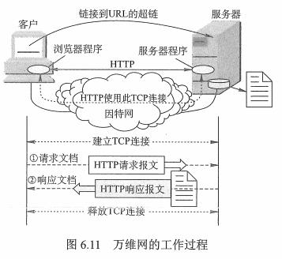
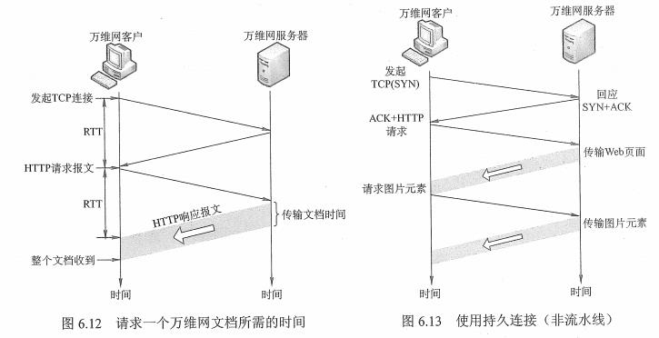
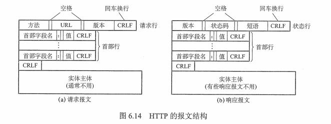
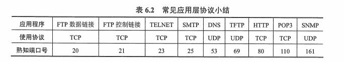

## 1 WWW 的概念与组成结构

三个标准组成：

* 统一资源定位符（URL）：负责标识万维网上的各种文档。
* 超文本传输协议（HTTP 端口 80）：应用层协议，使用 TCP 谅解进行可可靠传输。
* 超文本标记语言（HTML）：文档结构标记语言，使用约定的标记对页面上的各种信息进行描述。



## 2 浏览器访问过程

```java
1.浏览器分析链接指向页面的 URL (http://www.baidu.com/index.html)
2.浏览器解析 DNS 请求解析 IP 地址
3.域名系统 DNS 解析 IP 地址
4.建立 TCP 连接（端口 80）
5.发出 HTTP 请求 GET /index.html
6.服务器 HTTP 响应返回
7.释放 TCP 连接
8.解析 html 文件，显示                    
```

## 3 HTTP 特点

* http 是无状态的
* 通常使用 Cookie 加数据库跟踪用户活动
* 采用 TCP 作为运输层协议，保证数据可靠传输，但，HTTP 是无连接的
* HTTP 即可以使用非持久连接，也可以使用持久连接（HTTP/1.1 支持）



## 4 HTTP 报文结构

* 请求报文：客户端 -> 服务器
* 响应报文：服务器 -> 客户端



## 5 常用应用层协议

