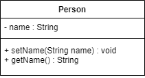
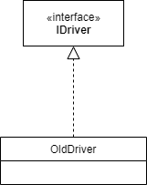

## 1 UML 图

统一建模语言（Unified Modeling Language，UML）是用来设计软件的可视化建模语言。它的特点是简单、统一、图形化、能表达软件设计中的动态与静态信息。

UML 从目标系统的不同角度出发，定义了用例图、类图、对象图、状态图、活动图、时序图、协作图、构件图、部署图等 9 种图。

## 2 类图

类图(Class diagram)是显示了模型的静态结构，特别是模型中存在的类、类的内部结构以及它们与其他类的关系等。类图不显示暂时性的信息。类图是面向对象建模的主要组成部分。它既用于应用程序的系统分类的一般概念建模，也用于详细建模，将模型转换成编程代码。类图也可用于数据建模。

### 2.2 表示方式

* +：表示 public
* -：表示 private
* \#：表示 protected

属性的完整表示方式是： **可见性 名称 ：类型 [ = 缺省值]**

方法的完整表示方式是： **可见性 名称(参数列表) [ ： 返回类型]**

###  2.3 类与类的关系

#### 2.3.1 关联关系

对象之间的一种引用关系，用于表示一类对象与另一类对象之间的联系。

* 单向关联

* 双向关联

* 自关联

#### 2.3.2 聚合关系

是关联关系的一种，是强的关联关系。聚合关系是整体和个体的关系。关联关系的两个类处于同一层次上，而聚合关系两个类处于不同的层次，一个是整体，一个是部分。

#### 2.3.3 组合关系

是关联关系的一种，是比聚合关系强的关系。它要求普通的聚合关系中代表整体的对象负责代表部分的对象的生命周期，组合关系不能共享。

#### 2.3.4 依赖关系

依赖关系是一种使用关系，它是对象之间耦合度最弱的一种关联方式，是临时性的关联。在代码中，某个类的方法通过局部变量、方法的参数或者对静态方法的调用来访问另一个类（被依赖类）中的某些方法来完成一些职责。

#### 2.3.5 继承关系

继承关系是对象之间耦合度最大的一种关系，表示一般与特殊的关系，是父类与子类之间的关系，是一种继承关系。

#### 2.3.6 实现关系

实现关系是接口与实现类之间的关系。在这种关系中，类实现了接口，类中的操作实现了接口中所声明的所有的抽象操作。

