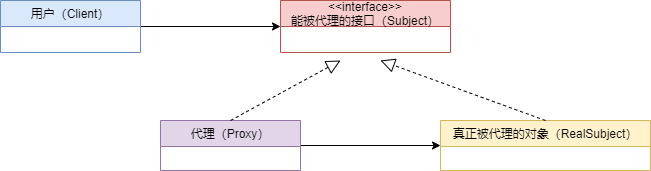

## 1 概述

由于某些原因需要给某对象提供一个代理以控制对该对象的访问。这时，访问对象不适合或者不能直接引用目标对象，代理对象作为访问对象和目标对象之间的中介。

代理（Proxy）模式分为三种角色：

- 抽象主题（Subject）类： 通过接口或抽象类声明真实主题和代理对象实现的业务方法。
- 真实主题（Real Subject）类： 实现了抽象主题中的具体业务，是代理对象所代表的真实对象，是最终要引用的对象。
- 代理（Proxy）类 ： 提供了与真实主题相同的接口，其内部含有对真实主题的引用，它可以访问、控制或扩展真实主题的功能。

为其他对象提供一种代理以控制对这个对象的访问（代理类相当于一个中介）。



## 2 静态代理

```java
//卖票接口
public interface SellTickets {
    void sell();
}

//火车站  火车站具有卖票功能，需要实现 SellTickets 接口
public class TrainStation implements SellTickets {
    public void sell() {
        System.out.println("火车站卖票");
    }
}

//黄牛 黄牛也是卖票，需要实现 SellTickets 接口
public class YellowCow implements SellTickets {
    private TrainStation station = new TrainStation();
    public void sell() {
        System.out.println("黄牛收取服务费用");
        station.sell();
    }
}

//测试类
public class TestClient {
    public static void main(String[] args) {
        YellowCow yc = new YellowCow();
        yc.sell();
    }
}
```

代理模式可以在不修改被代理对象的基础上，通过扩展代理类，进行一些功能的附加与增强。值得注意的是，代理类和被代理类应该共同实现一个接口，或者是共同继承某个类。

但是有弊端，假如这人不仅不仅要面膜，还要核导弹、航空母舰等等，就创建了许多代理类。

## 3 JDK动态代理

```java
//代理工厂，用来创建代理对象
public class ProxyFactory {
    private TrainStation station = new TrainStation();
    
    public SellTickets getProxyObject() {
        //使用Proxy获取代理对象
        /*
         *ClassLoader loader ： 类加载器，用于加载代理类，使用真实对象的类加载器即可
         *Class<?>[] interfaces ： 真实对象所实现的接口，代理模式真实对象和代理对象实现相同的接口
         *InvocationHandler h ： 代理对象的调用处理程序
         */
        SellTickets sellTickets = (SellTickets) Proxy.newProxyInstance(station.getClass().getClassLoader(),
                station.getClass().getInterfaces(),
                new InvocationHandler() {
                    /*
                     *proxy ： 代理对象
                     *method ： 对应于在代理对象上调用的接口方法的 Method 实例
                     *args ： 代理对象调用接口方法时传递的实际参数
                     */
                    public Object invoke(Object proxy, Method method, Object[] args) throws Throwable {
                        System.out.println("JDK动态代理：代理点收取一些服务费用");
                        //执行真实对象
                        Object result = method.invoke(station, args);
                        return result;
                    }
                });
        return sellTickets;
    }
}

//测试类
public class TestClient {
    public static void main(String[] args) {
        //获取代理对象
        ProxyFactory factory = new ProxyFactory();    
        SellTickets st = factory.getProxyObject();
        st.sell();
    }
}
```

由于使用了反射，效率比较低。

## 4 CGLIB动态代理

使用 JDK动态代理 必须定义一个接口，如果没有只定义一个类，就需要使用 CGLIB。

```xml
<dependency>
    <groupId>cglib</groupId>
    <artifactId>cglib</artifactId>
    <version>2.2.2</version>
</dependency>
```

```java
//火车站
public class TrainStation {
    public void sell() {
        System.out.println("火车站卖票");
    }
}

//代理工厂
public class ProxyFactory implements MethodInterceptor {
    private TrainStation target = new TrainStation();

    public TrainStation getProxyObject() {
        //创建Enhancer对象，类似于JDK动态代理的Proxy类，下一步就是设置几个参数
        Enhancer enhancer =new Enhancer();
        //设置父类的字节码对象
        enhancer.setSuperclass(target.getClass());
        //设置回调函数
        enhancer.setCallback(this);
        //创建代理对象
        TrainStation obj = (TrainStation) enhancer.create();
        return obj;
    }

    /*
     *o ： 代理对象
     *method ： 真实对象中的方法的Method实例
     *args ： 实际参数
     *methodProxy ：代理对象中的方法的method实例
     */
    public TrainStation intercept(Object o, Method method, Object[] args, MethodProxy methodProxy) throws Throwable {
        System.out.println("CGLIB动态代理:代理点收取一些服务费用");
        TrainStation result = (TrainStation) methodProxy.invokeSuper(o, args);
        return result;
    }
}

//测试类
public class TestClient {
    public static void main(String[] args) {
        //创建代理工厂对象
        ProxyFactory factory = new ProxyFactory();
        //获取代理对象
        TrainStation proxyObject = factory.getProxyObject();
        proxyObject.sell();
    }
}
```

## 5 代理对比

* jdk 代理和 CGLIB 代理
  - CGLib底层采用ASM字节码生成框架，使用字节码技术生成代理类，在 JDK1.6 之前比使用 Java 反射效率要高。唯一需要注意的是，CGLib不能对声明为 final 的类或者方法进行代理，因为 CGLib 原理是动态生成被代理类的子类。
  - 在 JDK1.6、JDK1.7、JDK1.8逐步对 JDK 动态代理优化之后，在调用次数较少的情况下，JDK代理效率高于CGLib 代理效率，只有当进行大量调用的时候，JDK1.6和JDK1.7比CGLib代理效率低一点，但是到JDK1.8的时候，JDK代理效率高于CGLib代理。所以如果有接口使用JDK动态代理，如果没有接口使用CGLIB代理。

* 动态代理和静态代理
  - 动态代理：接口中声明的所有方法都被转移到调用处理器一个集中的方法中处理（InvocationHandler.invoke）。这样，在接口方法数量比较多的时候，我们可以进行灵活处理，而不需要像静态代理那样每一个方法进行中转。
  - 如果接口增加一个方法，静态代理模式除了所有实现类需要实现这个方法外，所有代理类也需要实现此方法。增加了代码维护的复杂度。


